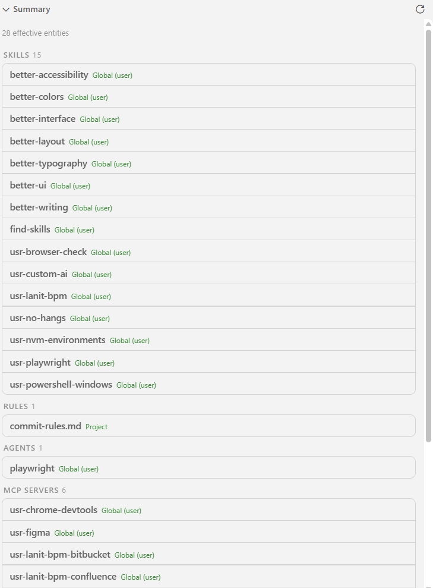
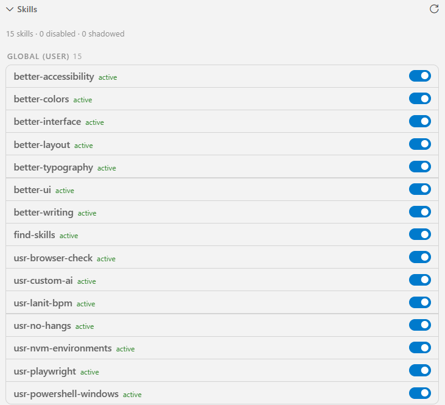
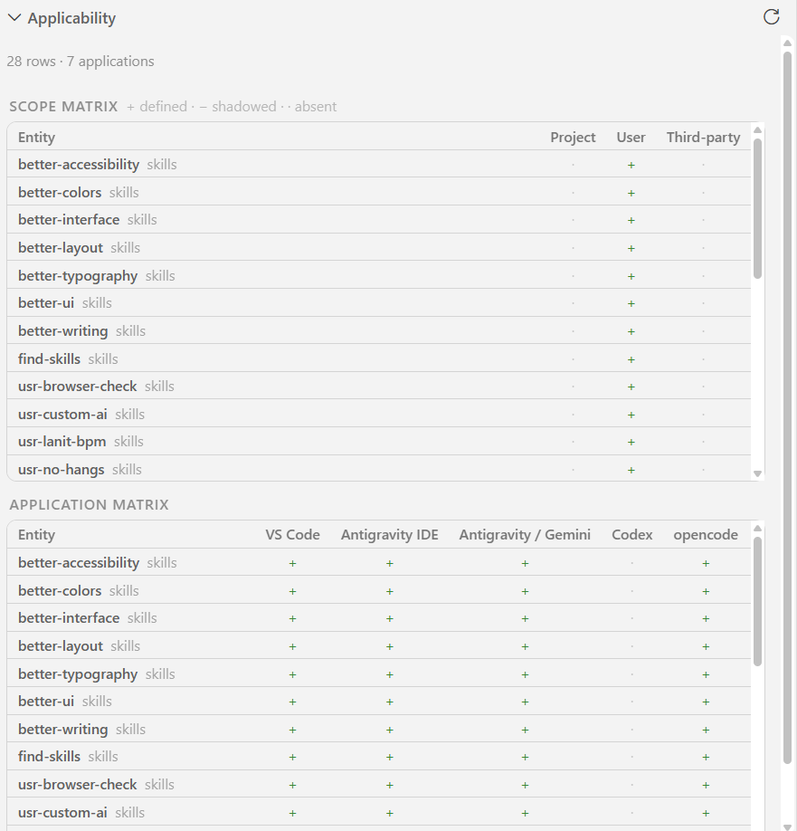

# Agent Context

[](https://marketplace.visualstudio.com/items?itemName=jenesei-software.vscode-agent-context)
[](CHANGELOG.md)
[](package.json)
[](LICENSE)

One panel that collects everything shaping your AI agents in the current project:
skills, agents, rules, MCP servers and plugins. It marks the source of every
entity, its scope (global or project), overrides and — most importantly — which
applications pick it up (VS Code, Antigravity IDE, Antigravity/Gemini, Codex,
opencode, Claude, Copilot).

## Screenshots

<table>
  <tr>
    <td align="center"><br><sub><b>Summary</b></sub></td>
    <td align="center"><br><sub><b>Skills</b></sub></td>
    <td align="center"><br><sub><b>Applicability</b></sub></td>
  </tr>
</table>

## Features

- **Summary** — the winning entity per category after applying shadowing and
  precedence rules, so you can see what is actually connected to the project.
- **Skills, Rules, Agents, MCP, Commands, Plugins** — compact card lists grouped
  by scope (Project, Global (user), Third-party) with one toggle per entity, the
  description in a hover tooltip and open/reveal actions on hover.
- **Enable / disable** — disabling renames a managed file to `*.disabled`
  (`SKILL.md.disabled`, `*.agent.md.disabled`, …), which hides it from every
  application and is fully reversible; MCP servers flip `enabled` in
  `servers.yaml`. The panel warns when an agent still references a disabled
  skill.
- **Applicability** — a compact scope matrix (Project / User / Third-party,
  `+` defined, `−` shadowed, `·` absent) and an application matrix (entities
  against the applications that discover them).
- **Health / Diagnostics** — broken frontmatter, duplicate names, missing
  referenced skills, invalid YAML/JSONC/TOML, missing secret environment
  variables, generated Codex agents without a canonical source.
- **Actions** — enable/disable entities, open files, open generated Codex
  agents, and copy environment variable names.
- **Live refresh** — file watchers on `~/.agents/**` and the workspace root.
- **Secret safety** — only environment variable *names* are read and shown,
  never values; the panel reports whether each variable is set in the process.

## How it works

`~/.agents` is treated as the canonical source of truth. The extension is
read-only except for toggles: it never runs scripts or regenerates files.

### Scopes and overrides

| Category | Global (user) | Project |
| --- | --- | --- |
| Skills | `~/.agents/skills/<name>/SKILL.md`; third-party `~/.copilot/skills`, `~/.claude/skills` | `.github/skills`, `.claude/skills`, `.agents/skills` |
| Agents | `~/.agents/agents/*.agent.md` | `.github/agents`, `.agents/agents` |
| Rules | `~/.agents/rules/*.md` | `.agents/rules/git-commits.md`, `.agents/*.md`, `commit-rules.md`, `.github/**`, `docs/commit-rules.md` |
| MCP | `~/.agents/mcp/servers.yaml` | `.vscode/mcp.json`, `.cursor/mcp.json` |
| Commands | opencode `~/.config/opencode/commands/*.md` | `.github/prompts/*.prompt.md`, `.opencode/command` |
| Plugins | `~/.config/opencode/plugins/*.ts` | `.opencode/plugin` |

- A **project** entity with the same `name` shadows the global one.
- **Rules** follow the `usr-commit` precedence: the first existing file wins
  (`<repo>/.agents/rules/git-commits.md` → other repo locations →
  `~/.agents/rules/git-commits.md`).
- **MCP** servers merge by key; a project key overrides the global one.

### Application mapping

| Application | Agents | Skills | MCP config |
| --- | --- | --- | --- |
| VS Code | `chat.agentFilesLocations` → `~/.agents/agents`, `.github/agents` | `~/.agents/skills`, `~/.copilot/skills`, `~/.claude/skills`, `.github/skills` | `%APPDATA%\Code\User\mcp.json` |
| Antigravity IDE | `~/.agents/agents` | `~/.agents/skills` | `%APPDATA%\Antigravity IDE\User\mcp.json` |
| Antigravity / Gemini | — | `~/.gemini/config/skills.json` → `~/.agents/skills` | `~/.gemini/config/mcp_config.json` |
| Codex | `~/.codex/agents/*.toml` (generated) | `~/.codex/skills` | `~/.codex/config.toml` (managed section) |
| opencode | `~/.config/opencode/opencode.jsonc` | `~/.agents/skills` | `~/.config/opencode/opencode.jsonc` (`mcp`) |
| Claude | `~/.claude/agents` | `~/.claude/skills` | `.mcp.json` |
| Copilot | — | `~/.copilot/skills`, `.github/skills` | — |

The paths-per-application mapping is versioned in `src/model/apps.ts`
(`APP_MAPPING_VERSION`) because discovery rules change between releases.

## Requirements

- VS Code `1.85.0` or newer.
- A canonical `~/.agents` directory (or a custom `agentContext.agentsRoot`).

## Installation

Install **Agent Context** from the Visual Studio Marketplace, or run
`npm run vsix` and install the generated `.vsix`.

## Getting started

1. Open the **Agent Context** view in the Activity Bar.
2. Expand **Summary** to see what actually applies in this workspace.
3. Use the per-category lists to enable/disable entities and jump to their files.
4. Use **Applicability** to see which applications pick up each entity.
5. Check **Health** before trusting a skill or agent.

## Settings

| Setting | Default | Scope | Description |
| --- | --- | --- | --- |
| `agentContext.agentsRoot` | `""` | machine-overridable | Canonical directory. Empty uses `~/.agents`. |
| `agentContext.showThirdPartySkills` | `true` | window | Include `~/.copilot/skills` and `~/.claude/skills`. |
| `agentContext.enabledApps` | all | window | Applications shown in Applicability and in tooltips. |

## Commands

| Command | Description |
| --- | --- |
| `Agent Context: Refresh` | Re-scan canonical and project sources. |
| `Agent Context: Show Applicability` | Focus the Applicability view. |
| `Agent Context: Open Settings` | Open the extension settings. |

## Security

- The extension is **read-only** except for enabling/disabling entities, and it
  never runs scripts or shell commands.
- It only modifies entities from the current scan and only inside managed roots
  (`~/.agents`, the workspace and the known global config directories), with
  symlinks resolved via `realpath`.
- `servers.yaml` is written atomically (temporary file + rename).
- In an **untrusted workspace** the panel is read-only: enabling and disabling
  is unavailable.
- It reads only environment variable **names**, never values.
- File reads are capped at 4 MB.

## Architecture

```text
src/
├─ extension.ts            composition root
├─ commands.ts             command registration
├─ config.ts               settings helpers
├─ statusBar.ts            status bar item
├─ model/                  types + versioned application registry
├─ parse/                  YAML frontmatter, JSONC and TOML parsers
├─ discovery/              scanners (skills, rules, agents, mcp, commands, plugins) + merge
├─ services/               context service, watcher, file/MCP editors
├─ views/                  generic list webview, builders, applicability webview
└─ test/                   node:test unit tests for the pure layers
```

## Roadmap

The plan below is fixed here on purpose, so the scope stays explicit.

### v1 — inspection and actions (shipped in this repository)

- Skills, Rules, Agents, MCP, Commands and Plugins across global and project
  scopes, with provenance, shadowing and a **Summary** view.
- Seven-application model and the applicability webview.
- Health diagnostics, status bar, live refresh.
- Actions: enable/disable entities, open/reveal, copy environment variable
  names, toggle MCP servers.

### v2 — generated vs canonical

- Diff canonical entities against each application's generated config, with a
  `stale` marker based on mtime/hash.
- Settings-driven VS Code hint (`chat.agentFilesLocations`).
- Scaffolds for creating a new skill or agent.
- Richer dashboard in the webview.

### v3 — workspace and remote

- Multi-root workspace context per folder.
- Remote / WSL path resolution.

## Support the project

- Star the repository on [GitHub](https://github.com/jenesei-software/vscode-agent-context).
- [Donate](https://www.donationalerts.com/r/jenesei).

## License

[MIT](LICENSE)
